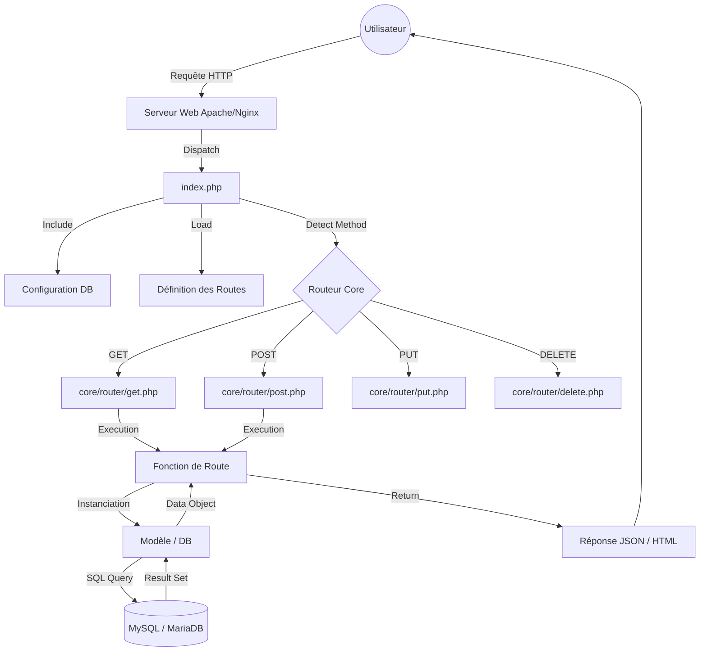

# Documentation Générale et Technique : Architecture Custom PHP
**Projet :** Kingabwa Architecture Custom
**Version :** 1.1.0 (Extended)
**Date :** 19 Janvier 2026
**Auteur :** Assistant IA & Équipe de Développement
**Statut :** Documentation de Référence

---

## 📑 Table des Matières Détaillée

1.  [1. Introduction et Vision](#1-introduction-et-vision)
    *   1.1. Pourquoi cette architecture ?
    *   1.2. Public Cible
    *   1.3. Comparaison avec les Frameworks du marché
2.  [2. Architecture Système](#2-architecture-système)
    *   2.1. Vue d'ensemble (Diagramme)
    *   2.2. Le Pattern MVC Revisité
    *   2.3. Flux de Données (Data Flow)
3.  [3. Structure du Système de Fichiers](#3-structure-du-système-de-fichiers)
    *   3.1. Arborescence Complète
    *   3.2. Rôle des Dossiers Clés
4.  [4. Analyse Approfondie du Noyau (Core)](#4-analyse-approfondie-du-noyau-core)
    *   4.1. Le Front Controller (`index.php`)
    *   4.2. Le Gestionnaire de Base de Données (Singleton)
    *   4.3. Le Routeur Interne (Dispatcheur)
    *   4.4. Gestion des Entrées/Sorties (I/O)
5.  [5. Guide d'Implémentation (Tutoriel)](#5-guide-dimplémentation-tutoriel)
    *   5.1. Créer une nouvelle ressource "Produit"
    *   5.2. Gérer les paramètres d'URL
    *   5.3. Traitement des Formulaires
    *   5.4. Retourner du JSON
6.  [6. Base de Données et Modèles](#6-base-de-données-et-modèles)
    *   6.1. Connexion PDO Optimisée
    *   6.2. Transactions et Atomicité
    *   6.3. Sécurité des Requêtes (Prepared Statements)
7.  [7. Intégration Frontend & API](#7-intégration-frontend--api)
    *   7.1. Consommer l'API avec JavaScript (Fetch)
    *   7.2. Gestion du CORS
    *   7.3. Upload de Fichiers (Asynchrone)
8.  [8. Configuration Serveur & Déploiement](#8-configuration-serveur--déploiement)
    *   8.1. Apache (.htaccess)
    *   8.2. Nginx (nginx.conf)
    *   8.3. Optimisations PHP.ini
9.  [9. Sécurité Avancée](#9-sécurité-avancée)
    *   9.1. Injection SQL
    *   9.2. XSS (Cross-Site Scripting)
    *   9.3. CSRF (Cross-Site Request Forgery)
    *   9.4. Protection des fichiers sensibles
10. [10. Dépannage et Maintenance](#10-dépannage-et-maintenance)
11. [11. Annexes et Glossaire](#11-annexes-et-glossaire)

---

## 1. Introduction et Vision

### 1.1. Pourquoi cette architecture ?
Dans un écosystème dominé par des géants comme Laravel, Symfony ou CodeIgniter, le choix d'une architecture "maison" (Custom) peut sembler audacieux. C'est pourtant un choix stratégique fort pour ce projet.

**Les avantages clés :**
1.  **Performance Brute :** Aucun overhead. Chaque ligne de code exécutée est une ligne utile. Le temps de chargement initial (TTFB) est réduit au strict minimum.
2.  **Maîtrise Totale :** Pas de "boîte noire". Le développeur sait exactement comment une requête est transformée en réponse.
3.  **Indépendance :** Aucune dépendance à gérer via Composer pour le cœur du système. Pas de risque de "breaking changes" lors d'une mise à jour de framework tiers.
4.  **Éducatif :** Idéal pour comprendre les mécanismes basiques du web (HTTP, SQL, Routing).

### 1.2. Public Cible
Cette documentation s'adresse aux :
*   **Développeurs Backend PHP** qui maintiennent l'API.
*   **Développeurs Frontend** qui consomment les endpoints JSON.
*   **DevOps** responsables du déploiement de l'application.

### 1.3. Comparaison avec les Frameworks du marché

| Critère | Notre Architecture | Laravel / Symfony |
| :--- | :--- | :--- |
| **Complexité** | Faible (Code procédural/OO simple) | Élevée (DI, Events, Service Containers) |
| **Poids** | < 100 Ko | > 50 Mo (avec vendors) |
| **Courbe d'apprentissage** | Rapide (PHP natif) | Longue (Concepts spécifiques) |
| **Flexibilité** | Totale (on code ce qu'on veut) | Contrainte par le framework |
| **Fonctionnalités** | Minimales (à implémenter) | "Batteries included" (Auth, Queue, Mail...) |

---

## 2. Architecture Système

### 2.1. Vue d'ensemble (Diagramme)

Le schéma suivant illustre le flux d'une requête au sein de l'application.



### 2.2. Le Pattern MVC Revisité
Nous utilisons une variation simplifiée du MVC (Modèle-Vue-Contrôleur) :
*   **Modèle (M) :** Classes dans `core/models/`. Gèrent les données.
*   **Vue (V) :** Absente au sens traditionnel (Template Engine). La "Vue" est ici la sortie JSON (`echo json_encode()`) ou du HTML brut dans les contrôleurs.
*   **Contrôleur (C) :** Les fonctions anonymes (Closures) définies dans `core/routers/index.php`. Elles font le lien entre la requête et le modèle.

### 2.3. Flux de Données (Data Flow)
1.  Les données entrent brutes (Raw Body JSON ou Form Data).
2.  Elles sont normalisées par les handlers (`get.php`, `post.php`).
3.  Elles sont validées dans la fonction de route.
4.  Elles sont passées au Modèle.
5.  Le Modèle interroge la BDD via PDO (Prepared Statements).
6.  La réponse remonte la chaîne pour être sérialisée en JSON.

---

## 3. Structure du Système de Fichiers

### 3.1. Arborescence Complète

```text
PROJET_RACINE/
│
├── core/                       # [CRITIQUE] Cœur du système
│   ├── config/                 # Configuration
│   │   ├── database.php        # Classe Database (Singleton)
│   │   └── database.sql        # Schéma SQL initial
│   │
│   ├── doc/                    # Documentation interne (assets, pdf...)
│   │
│   ├── models/                 # [M] Modèles de données
│   │   ├── User.php            # Exemple de modèle Utilisateur
│   │   └── index.php           # (Sécurité: fichier vide)
│   │
│   ├── router/                 # [Moteur] Logique de routage
│   │   ├── get.php             # Handler GET
│   │   ├── post.php            # Handler POST (JSON aware)
│   │   ├── put.php             # Handler PUT
│   │   ├── delete.php          # Handler DELETE
│   │   └── options.php         # Handler OPTIONS (CORS)
│   │
│   └── routers/                # [C] Définition des routes
│       ├── index.php           # Tableau de mapping URL => Fonction
│       └── document.md         # Notes sur les routes
│
├── index.php                   # [Entrée] Front Controller
├── ARCHITECTURE.md             # Résumé Architecture
├── DOCUMENTATION_GENERALE.md   # Ce fichier
└── README.md                   # Guide d'installation
```

### 3.2. Rôle des Dossiers Clés
*   **`core/router` vs `core/routers`** : Attention à la nuance sémantique.
    *   `router` (singulier) contient la **mécanique** (le "comment ça marche").
    *   `routers` (pluriel) contient la **configuration** (les "routes" elles-mêmes).
*   **`index.php`** : C'est le chef d'orchestre. Il ne contient aucune logique métier, seulement de la logique d'initialisation.

---

## 4. Analyse Approfondie du Noyau (Core)

### 4.1. Le Front Controller (`index.php`)
Le fichier `index.php` effectue les tâches suivantes :
1.  **Configuration de l'environnement :** `ini_set`, `error_reporting`. C'est ici qu'on bascule entre mode DEV et PROD.
2.  **Chargement des dépendances :** Inclusion manuelle des fichiers core (`require_once`).
3.  **Chargement des routes :** Importation du tableau retourné par `core/routers/index.php`.
4.  **Dispatching :** Un `switch` sur `$_SERVER['REQUEST_METHOD']` dirige l'exécution vers le bon handler.

### 4.2. Le Gestionnaire de Base de Données (Singleton)
Le fichier `core/config/database.php` est crucial.

```php
// Pattern Singleton pour éviter les connexions multiples
public static function getInstance() {
    if (self::$instance === null) {
        self::$instance = new self();
    }
    return self::$instance;
}
```
**Attributs PDO :**
*   `PDO::ATTR_ERRMODE => PDO::ERRMODE_EXCEPTION` : Lance une exception PHP en cas d'erreur SQL (indispensable pour les try/catch).
*   `PDO::ATTR_DEFAULT_FETCH_MODE => PDO::FETCH_ASSOC` : Retourne les résultats sous forme de tableaux associatifs par défaut.

### 4.3. Le Routeur Interne (Dispatcheur)
Prenons l'exemple de `core/router/post.php`.

```php
function handlePostRequest($routes) {
    // 1. Analyse de l'URI
    $uri = parse_url($_SERVER['REQUEST_URI'], PHP_URL_PATH);
    
    // 2. Normalisation (suppression slash final, gestion racine)
    $uri = trim($uri, '/');
    $uri = ($uri === '') ? '/' : '/' . $uri;

    // 3. Correspondance (Matching)
    if (array_key_exists($uri, $routes)) {
        // 4. Lecture du Body (JSON)
        $data = json_decode(file_get_contents('php://input'), true);
        
        // 5. Fallback Form Data
        if (!$data && !empty($_POST)) {
            $data = $_POST;
        }
        
        // 6. Exécution
        call_user_func($routes[$uri], $data);
    } else {
        // 7. Erreur 404
        http_response_code(404);
        echo json_encode(['error' => 'Route not found']);
    }
}
```
**Points d'attention :**
*   La fonction gère nativement le JSON et le `x-www-form-urlencoded`.
*   Le `call_user_func` permet d'exécuter la fonction anonyme associée à la clé du tableau.

---

## 5. Guide d'Implémentation (Tutoriel)

Supposons que nous voulions créer une gestion de **Produits**.

### 5.1. Créer une nouvelle ressource "Produit"

**Étape 1 : Créer la table SQL**
```sql
CREATE TABLE products (
    id INT AUTO_INCREMENT PRIMARY KEY,
    name VARCHAR(255) NOT NULL,
    price DECIMAL(10, 2) NOT NULL
);
```

**Étape 2 : Créer le Modèle (`core/models/Product.php`)**
```php
<?php
require_once __DIR__ . '/../config/database.php';

class Product {
    private $conn;

    public function __construct() {
        $this->conn = Database::getInstance()->getConnection();
    }

    public function create($name, $price) {
        $sql = "INSERT INTO products (name, price) VALUES (:name, :price)";
        $stmt = $this->conn->prepare($sql);
        return $stmt->execute(['name' => $name, 'price' => $price]);
    }
}
```

**Étape 3 : Déclarer la Route (`core/routers/index.php`)**
```php
require_once __DIR__ . '/../models/Product.php';

return [
    // ...
    'POST' => [
        '/products' => function($data) {
            header('Content-Type: application/json');
            
            // Validation simple
            if (empty($data['name']) || empty($data['price'])) {
                http_response_code(400);
                echo json_encode(['error' => 'Missing fields']);
                return;
            }

            $product = new Product();
            if ($product->create($data['name'], $data['price'])) {
                http_response_code(201);
                echo json_encode(['status' => 'Created']);
            }
        }
    ]
];
```

### 5.2. Gérer les paramètres d'URL
L'architecture actuelle ne gère pas nativement `/products/123`. Il faut utiliser les Query Params : `/products?id=123`.

```php
'GET' => [
    '/product' => function() {
        $id = $_GET['id'] ?? null;
        if (!$id) { /* Erreur 400 */ }
        
        $model = new Product();
        $item = $model->find($id);
        echo json_encode($item);
    }
]
```

### 5.4. Retourner du JSON
Pour standardiser les réponses, vous pouvez créer une fonction helper :

```php
// function response($data, $status = 200)
function jsonResponse($data, $status = 200) {
    header('Content-Type: application/json');
    http_response_code($status);
    echo json_encode($data);
    exit;
}
```

---

## 6. Base de Données et Modèles

### 6.1. Connexion PDO Optimisée
La configuration PDO dans `core/config/database.php` est le point central.
Assurez-vous que l'encodage est bien défini sur `utf8mb4` pour supporter tous les caractères (y compris les Emojis).

```php
$dsn = "mysql:host={$this->host};dbname={$this->db_name};charset=utf8mb4";
```

### 6.2. Transactions et Atomicité
Pour des opérations complexes (ex: Créer une commande + Créer les lignes de commande), utilisez les transactions.

```php
public function createOrderWithItems($orderData, $items) {
    try {
        $this->conn->beginTransaction();

        // 1. Créer la commande
        $stmtOrder = $this->conn->prepare("INSERT INTO orders ...");
        $stmtOrder->execute(...);
        $orderId = $this->conn->lastInsertId();

        // 2. Créer les lignes
        $stmtItem = $this->conn->prepare("INSERT INTO order_items (order_id, ...) ...");
        foreach ($items as $item) {
            $stmtItem->execute(['order_id' => $orderId, ...]);
        }

        $this->conn->commit();
        return true;
    } catch (Exception $e) {
        $this->conn->rollBack();
        throw $e;
    }
}
```

### 6.3. Sécurité des Requêtes (Prepared Statements)
La règle d'or : **Jamais de concaténation de chaînes dans le SQL.**

*   ❌ `SELECT * FROM users WHERE name = '$name'` -> **VULNÉRABLE**
*   ✅ `SELECT * FROM users WHERE name = :name` -> **SÉCURISÉ**

Les Prepared Statements séparent la structure de la requête SQL des données, empêchant l'analyseur SQL d'interpréter les données comme du code.

---

## 7. Intégration Frontend & API

### 7.1. Consommer l'API avec JavaScript (Fetch)

```javascript
// Exemple de création d'utilisateur depuis le front
async function createUser(username, email) {
    const response = await fetch('/users', {
        method: 'POST',
        headers: {
            'Content-Type': 'application/json'
        },
        body: JSON.stringify({ username, email })
    });

    if (!response.ok) {
        const error = await response.json();
        console.error('Erreur:', error);
        return;
    }

    const result = await response.json();
    console.log('Succès:', result);
}
```

### 7.2. Gestion du CORS
Si votre frontend est sur un autre port ou domaine (ex: React sur localhost:3000 et API sur localhost:8000), vous devez gérer le CORS (Cross-Origin Resource Sharing).

Dans `index.php`, nous avons déjà un bloc `OPTIONS` :
```php
header("Access-Control-Allow-Origin: *"); // En prod, mettez votre domaine précis
header("Access-Control-Allow-Methods: GET, POST, PUT, DELETE, OPTIONS");
header("Access-Control-Allow-Headers: Content-Type, Authorization");
```

---

## 8. Configuration Serveur & Déploiement

Pour que le routage fonctionne, toutes les requêtes doivent être redirigées vers `index.php`.

### 8.1. Apache (.htaccess)
Créez un fichier `.htaccess` à la racine :

```apache
RewriteEngine On
# Si le fichier ou dossier demandé n'existe pas
RewriteCond %{REQUEST_FILENAME} !-f
RewriteCond %{REQUEST_FILENAME} !-d
# Rediriger vers index.php
RewriteRule ^(.*)$ index.php [QSA,L]
```

### 8.2. Nginx (nginx.conf)
Dans votre bloc `server` :

```nginx
location / {
    try_files $uri $uri/ /index.php?$query_string;
}

location ~ \.php$ {
    include snippets/fastcgi-php.conf;
    fastcgi_pass unix:/var/run/php/php7.4-fpm.sock;
}
```

### 8.3. Optimisations PHP.ini
Pour la production :
*   `display_errors = Off`
*   `log_errors = On`
*   `memory_limit = 256M`
*   `opcache.enable = 1`

---

## 9. Sécurité Avancée

### 9.1. Injection SQL
Traitée par l'utilisation systématique de `PDO::prepare()`.

### 9.2. XSS (Cross-Site Scripting)
Si votre API renvoie du JSON, le risque XSS est faible côté serveur, c'est au frontend (JS) de ne pas injecter le contenu dans le DOM via `innerHTML` sans précaution.
Si vous renvoyez du HTML (ex: page d'erreur), utilisez `htmlspecialchars($var, ENT_QUOTES, 'UTF-8')`.

### 9.3. CSRF (Cross-Site Request Forgery)
Puisque nous n'utilisons pas de sessions par défaut (Stateless API), le CSRF est moins pertinent qu'avec des cookies de session. Cependant, si vous ajoutez une authentification par Cookie, vous DEVEZ implémenter un token CSRF (champ caché dans les formulaires vérifié côté serveur).

### 9.4. Protection des fichiers sensibles
Empêchez l'accès web direct au dossier `core/`.
Dans `core/.htaccess` :
```apache
Deny from all
```
Cela garantit que personne ne peut télécharger `core/config/database.php` et lire vos mots de passe BDD.

---

## 10. Dépannage et Maintenance

| Symptôme | Cause Probable | Solution |
| :--- | :--- | :--- |
| **Erreur 404 sur les routes** | URL Rewriting inactif | Vérifier `.htaccess` / Config Nginx / `AllowOverride All` Apache |
| **Page Blanche** | Erreur PHP masquée | Mettre `display_errors` à 1 dans `index.php` ou vérifier logs serveur |
| **"Route not found (POST)"** | Méthode HTTP incorrecte | Vérifier que le fetch JS utilise bien `method: 'POST'` |
| **Données reçues vides** | Header Content-Type manquant | Ajouter `Content-Type: application/json` dans la requête JS |
| **Erreur SQL "Table doesn't exist"** | BDD non initialisée | Importer `core/config/database.sql` |
| **CORS Error** | Headers manquants | Vérifier la section `OPTIONS` dans `index.php` |

---

## 11. Annexes et Glossaire

*   **API (Application Programming Interface)** : Interface permettant à deux systèmes de communiquer (ici Frontend <-> Backend).
*   **CRUD (Create, Read, Update, Delete)** : Les 4 opérations de base sur les données.
*   **Endpoint** : Une URL spécifique de l'API (ex: `/users`).
*   **JSON (JavaScript Object Notation)** : Format d'échange de données léger.
*   **PDO (PHP Data Objects)** : Extension PHP définissant une interface pour accéder aux bases de données.
*   **Singleton** : Patron de conception garantissant qu'une classe n'a qu'une seule instance.
*   **URI (Uniform Resource Identifier)** : Chaîne identifiant une ressource web.

---
*Ce document est vivant et doit être mis à jour à chaque modification majeure de l'architecture.*
